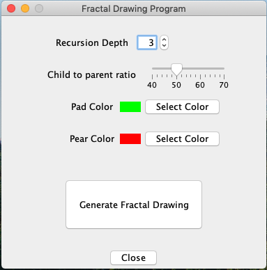

# Simple Fractal

This is a simple Java program that draws a prickly pear cactus base on user requested parameters.

- It utilizes Java Swing for the graphical user interface
- It follows the Observer design pattern for data transfer

Example of GUI:

Example of Output:

> This project was part of the curriculum in CSC 143 Computer Programming II at North Seattle College in Summer 2020, taught by Mr.Bill Barry.
